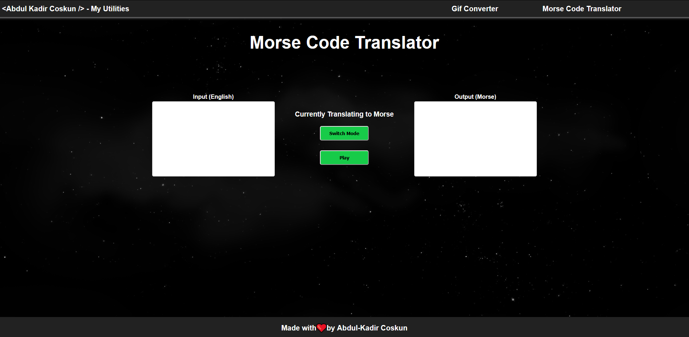

# Morse Code Translator

A simple program that converts text to morse code.

## Description

A program that was developed to help people learn morse code as well as test their understanding. The program is simple and easy to use. It is also easy to use in a classroom environment as well as in a home environment.

---

| Table of Contents               |
| ------------------------------- |
| [Functionality](#Functionality) |
| [Front End Tech](#FrontEndTech) |
| [License](#License)             |
| [Contributors](#Contributors)   |
| [Links](#Links)                 |
| [Screenshot](#Screenshot)       |

---

## Functionality

-   Translates text to morse code and vice versa.
-   Can be used in the browser or in a terminal.
-   Provides a visual representation of the morse code.
-   Allows the user a audio feedback of the morse code.
-   Deployed to Github Pages using Actions.

## Improvements to Come

-   Add better visual representation of the morse code.
-   Add a sound effect when the user inputs a letter.
-   Improve SCSS styling and implementation.

## Front End Tech

-   JavaScript
-   HTML
-   SCSS
-   React
-   Node.js

## Testing

-   CodeQL
-   Jest

## License

## Contributors

-   Abdul-Kadir Coskun <https://github.com/chizaruu>

### Github Repository

<https://github.com/chizaruu/morse-code-translator>

### URL

<https://chizaruu.github.io/morse-code-translator/>

### Screenshot

Landing Page

